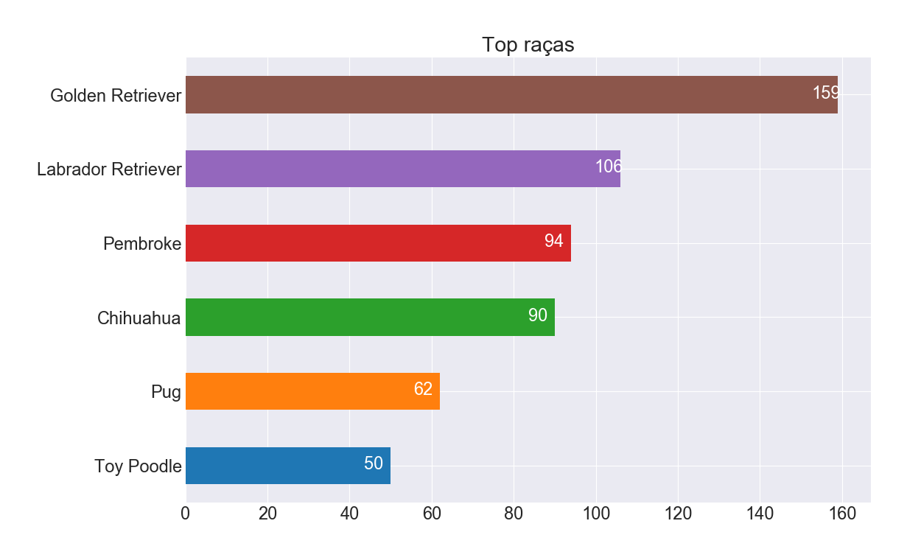
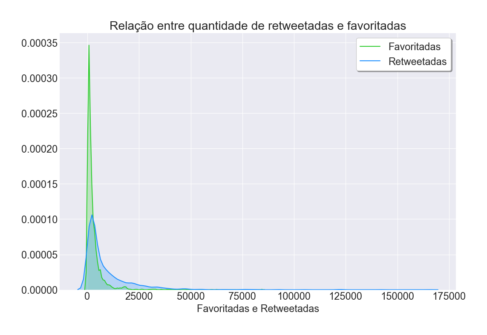
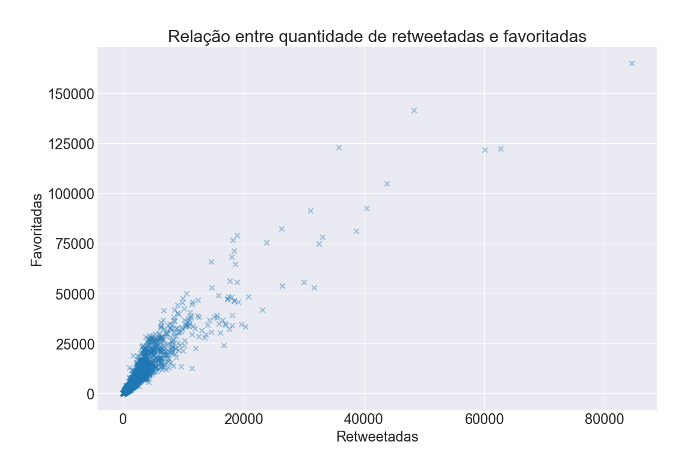
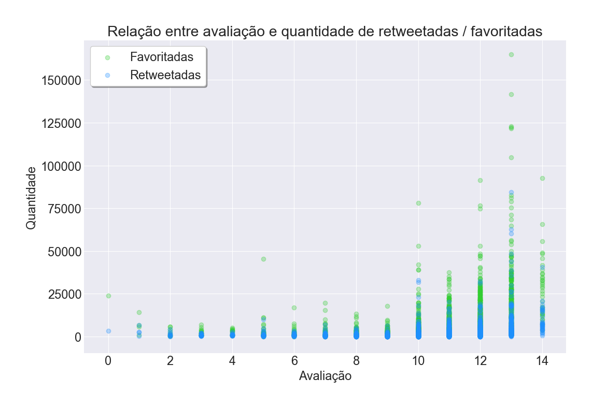
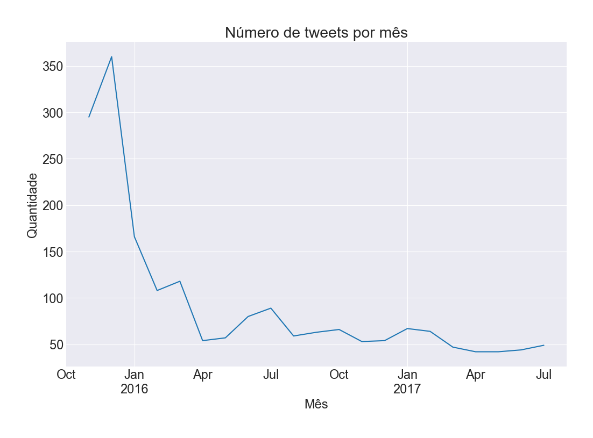

# Projeto de Data Wrangling: WeRateDogs Twitter - [Udacity](https://www.udacity.com/)

## Introdução
Dados raramente vem limpos. O objetivo do projeto foi coletar vários dados de diversas fontes e com variedade de formatos, avaliar a qualidade, arrumar e limpá-los. Sendo documentado os processos em um notebook Jupyter `wrangle_act.ipynb`, além de exibir as análises e visualizações no `act_report.pdf`.

### Entendendo a origem dos dados
O conjunto de dados trabalhado é do usuário do Twitter [@dog_rates](https://twitter.com/dog_rates), conhecido como [WeRateDogs](https://en.wikipedia.org/wiki/WeRateDogs). WeRateDogs é uma conta no Twitter que classifica os cães das pessoas com um comentário bem humorado sobre o cão. Ele foi iniciado em 2015 pelo estudante universitário Matt Nelson e recebeu cobertura da mídia internacional. Em outubro de 2017 tinha mais 3,7 milhões de seguidores. Estas classificações têm quase sempre um denominador de 10. Mas e os numeradores? Quase sempre maior que 10. 11/10, 12/10, 13/10, etc.

Imagem retirada de [Boston Magazine](http://www.bostonmagazine.com/arts-entertainment/blog/2017/04/18/dog-rates-mit/)

&nbsp;

&nbsp;

O Dogtionary explica os diversos estágios do cão: doggo, pupper, puppo e floof(er) (pelo [livro #WeRateDogs na Amazon](https://www.amazon.com/WeRateDogs-Most-Hilarious-Adorable-Youve/dp/1510717145))

### Contexto fornecido pela Udacity
WeRateDogs deu à Udacity acesso exclusivo a seu arquivo tweets para este projeto. Este arquivo contém dados básicos de tweets para todos os seus mais de 5000 tweets como eles estavam em 1 de agosto de 2017. Coleta, avaliação e limpeza adicionais foram necessárias. Esse arquivo contém dados básicos de tweets. Uma coluna o arquivo contém com certeza: cada texto de tweet, que a Udacity usou para extrair classificação, nome e "estágio" do cachorro (ou seja, doggo, floofer, pupper e puppo). Esses dados foram extraídos por meio de programação, mas sem muito rigor, o que torna alguns deles inválidos, requerendo assim uma boa análise para utilização futura.

A contagem de retweets e favoritos são duas colunas omissas notáveis. Felizmente, esses dados adicionais podem ser coletados da API do Twitter, mas, só porque foi fornecido as IDs no arquivo de tweets (sem essas identificações, o público só tem acesso aos últimos ~3000 tweets pela API do Twitter). Esses dados adicionais foram reunidos no projeto.

Foi utilizado previamente uma rede neural para classificar as raças dos cachorros de cada imagem dos tweets. Os resultados foram colocados na tabela `image_predictions.tsv`.

*Curiosidade: criar esta rede neural é um dos projetos do [programa Nanodegree de Inteligência Artificial](https://www.udacity.com/course/artificial-intelligence-nanodegree--nd889) na Udacity.

### Premissas do projeto
- Só há interesse em classificações originais (não retweets) que têm imagens;
- Avaliar e limpar totalmente a base de dados, identificando os problemas e realizando respectiva limpeza;
- A limpeza inclui a fusão de acordo com as regras de [dados arrumados](https://cran.r-project.org/web/packages/tidyr/vignettes/tidy-data.html) para facilitar a análise e visualização.

### Pacotes Python utilizados
- pandas
- numpy
- requests
- tweepy
- json
- tqdm
- matplotlib
- seaborn

## Detalhes do projeto

### Glossário dos arquivos

| **Arquivo**                      | **Descrição**                                                                 |
|----------------------------------|-------------------------------------------------------------------------------|
| **GraphXX.png**                  | Gráfico gerado e exportado durante visualização dos dados.                    |
| **act_report.pdf**               | Documento das análises e insights sobre os dados finais.                      |
| **errors.csv**                   | Erros gerados durante coleta dos dados via API do twitter.                    |
| **image_predictions.tsv**        | Predições das raças dos cachorros dos tweets fornecidas pela Udacity.         |
| **tweet_json.txt**               | Dados recolhidos via API do twitter e exportado em json.                      |
| **twitter_archive_enhanced.csv** | Dados base disponibilizados previamente pela Udacity.                         |
| **twitter_archive_master.csv**   | Arquivo final com dataset compilado e limpo.                                  |
| **wrangle_act.html**             | Notebook Jupyter exportado em HTML.                                           |
| **wrangle_act.ipynb**            | Arquivo principal do projeto, trabalhado e documentado em Notebook Jupyter.   |
| **wrangle_report.pdf**           | Documentação descritiva dos esforços para coleta, análise e limpeza dos dados.|

### Etapas
  - Data Wrangling, que consiste em:
    - Coletar dados
    - Avaliar dados
    - Limpar dados
  - Armazenar, analisar e visualizar dados wrangled
  - Elaborar relatórios sobre ações executadas de data wrangling, análises e visualizações dos dados

### Coleta de dados
1. `twitter_archive_enhanced.csv`: base disponibilizada previamente. O projeto já começa com ele em mãos.
2. `image_predictions.tsv`: predições das raças dos tweets, disponível no servidor Udacity, baixado programaticamente.
3. `tweet_json.txt`: contagem de retweets, favoritos e quaisquer dados adicionais, foram baixados via API do Twitter. PS: Os erros gerados pela API foram armazenados no `errors.csv` para possível análise futura.

### Avaliação dos dados
Após coleta dos dados, foi avaliado os problemas de qualidade e arrumação dos datasets. Relatório:

**Qualidade**:
  - `twitter_archive_enhanced.csv`:
    - Há retweets e respostas no meio dos tweets. Esses precisaram ser descartados;
    - As notas de avaliação as vezes não se referem de fato as notas do tweet;
    - A coluna `source` tem parte html. Precisou ser limpa;
    - Há tweets que não contêm imagem. Esses precisaram ser descartados;
    - Tem muitos "None" no lugar de NaN;
    - Muitos nomes da coluna `name` estão incorretos;
    - Alguns denominadores são diferentes de 10 e podendo impactar nas estatisticas;
    - Algumas notas são pontuações muito discrepantes e precisaram ser ajustadas.
  - `image_predictions.tsv`:
    - As predições contêm underline ao invés de espaços em braco;
    - Algumas predições começam com letra minúscula e outras em maiúsculas;

**Arrumação**:
  - `twitter_archive_enhanced.csv`:
    - Alterado os tipos de dados de diversas colunas;
    - Juntado as colunas `doggo`, `floofer`, `pupper` e `puppo` para uma só;
    - Descartado colunas de respostas (`reply`) e `retweeteds`;
    - Descartado a coluna do denominador, a partir do momento que todos forem 10;
  - `image_predictions.tsv`:
    - Juntado as 3 predições, mantendo a predição de cachorro mais confiável;
    - Descartado as colunas `p1*`, `p2*`, `p3*`, `img_num`;
  - Juntado os três arquivos em um só através do `tweet_id`;

### Limpeza dos dados e armazenamento:
Realizado limpeza dos problemas listados acima, documentado todas as etapas no notebook Jupyter e exportado para o `twitter_archive_master.csv`.

### Análises e visualizações obtidas:

Os tweets da conta **WeRateDogs** são bem interessantes e a comunidade parece gostar
deles. Com uma média de aproximadamente 8.900 favoritadas e 2.700 retweetadas, a conta
realiza diversas análises rápidas de fotos de cachorros que são disponibilizadas, com notas que
vão de 0 até 14, eles normalmente avaliam acima de 10. Sendo a média de avaliação de 10,5.
Tudo isso em uma escala de 0 a 10, vale salientar.

Foi verificado que existe uma correlação fraca entre a nota e o número de
retweetadas/favoritadas, mas a tendência apresentada é que a comunidade gosta mais de notas
acima de 10.

#### Principais métricas obtidas pelo método `describe` do `twitter_archive_master.csv`:

|           | **retweet_count** | **favorite_count** | **rating** | **prediction_conf** |
|-----------|-------------------|--------------------|------------|---------------------|
| **count** | 1979.000          | 1979.000           | 1979.000   | 1673.000            |
| **mean**  | 2717.247          | 8895.915           | 10.541     | 0.552               |
| **std**   | 4804.043          | 12933.490          | 2.176      | 0.298               |
| **min**   | 12.000            | 80.000             | 0.000      | 0.000               |
| **25%**   | 603.000           | 1940.000           | 10.000     | 0.307               |
| **50%**   | 1311.000          | 4037.000           | 11.000     | 0.551               |
| **75%**   | 3097.000          | 11102.500          | 12.000     | 0.823               |
| **max**   | 84501.000         | 164946.000         | 14.000     | 0.999               |

&nbsp;

&nbsp;

#### Principais raças encontradas nos tweets:

Através dos dados, é possível ver que os Golden Retriver são de longe os mais frequente
entre os tweets do WeRateDogs, com uma diferença considerável do Labrador Retriever, que
ocupa o segundo lugar. A comunidade deve gostar deles.

&nbsp;

&nbsp;

#### Concentração da quantidade de retweets e favoritos. Via gráfico de densidade:

Infelizmente a grande maioria dos tweets dificilmente ultrapassam a faixa dos 25.000
retweetadas e favoritadas. Ficando sua grande maioria abaixo dos 12.000. É perceptível a concentração dos dados em valores mais baixos, sendo exceção os grandes valores alcançados.

&nbsp;

&nbsp;

#### Gráfico de dispersão para a relação entre quantidade de retweets e favoritos:

Aqui temos outra distribuição da relação do número de retweetadas e favoritadas.
Sendo possível verificar poucos tweets alcançando grandes números, mas a relação entre os
dois é evidente. Quanto mais retweetado for, mais favoritado tende ser. Possuindo uma forte
correlação positiva de 92%.

&nbsp;

&nbsp;

#### Distribuição das avaliações e quantidade de retweets/favoritos:

Essa distribuição é interessante. Avaliações baixas tendem a receber menos favoritadas
e retweetadas, e o esperado é que apenas as avaliações acima de 10, recebam real alcance. Com
breve destaque nas avaliações com nota 13, onde alcançaram grandes números.

&nbsp;

&nbsp;

#### Frequência de tweets por mês:

Houve um pico de tweets no final de 2015, conseguindo chegar a um pouco mais de 350
tweets em um só mês. Logo após o pico, a frequência diminuiu consideravelmente e se manteve
na faixa dos 50 tweets/mês. Por onde será que andou o WeRateDogs?
