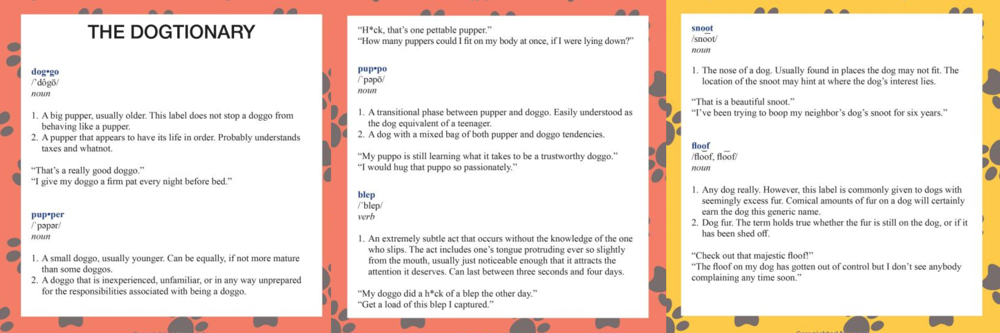

# Projeto de Data Wrangling: WeRateDogs Twitter - [Udacity](https://www.udacity.com/)

## Introdução
Dados raramente vem limpos. O objetivo do projeto foi coletar vários dados de diversas fontes e com variedade de formatos, avaliar a qualidade, arrumar e limpá-los. Sendo documentado os processos em um notebook Jupyter `wrangle_act.ipynb`, além de exibir as análises e visualizações no `act_report.pdf`.

### Entendendo a origem dos dados
O conjunto de dados trabalhado é do usuário do Twitter [@dog_rates](https://twitter.com/dog_rates), conhecido como [WeRateDogs](https://en.wikipedia.org/wiki/WeRateDogs). WeRateDogs é uma conta no Twitter que classifica os cães das pessoas com um comentário bem humorado sobre o cão. Ele foi iniciado em 2015 pelo estudante universitário Matt Nelson e recebeu cobertura da mídia internacional. Em outubro de 2017 tinha mais 3,7 milhões de seguidores. Estas classificações têm quase sempre um denominador de 10. Mas e os numeradores? Quase sempre maior que 10. 11/10, 12/10, 13/10, etc.

Imagem retirada de [Boston Magazine](http://www.bostonmagazine.com/arts-entertainment/blog/2017/04/18/dog-rates-mit/)

O Dogtionary explica os diversos estágios do cão: doggo, pupper, puppo e floof(er) (pelo [livro #WeRateDogs na Amazon](https://www.amazon.com/WeRateDogs-Most-Hilarious-Adorable-Youve/dp/1510717145))

### Contexto fornecido pela Udacity
WeRateDogs deu à Udacity acesso exclusivo a seu arquivo tweets para este projeto. Este arquivo contém dados básicos de tweets para todos os seus mais de 5000 tweets como eles estavam em 1 de agosto de 2017. Coleta, avaliação e limpeza adicionais foram necessárias. Esse arquivo contém dados básicos de tweets. Uma coluna o arquivo contém com certeza: cada texto de tweet, que a Udacity usou para extrair classificação, nome e "estágio" do cachorro (ou seja, doggo, floofer, pupper e puppo). Esses dados foram extraídos por meio de programação, mas sem muito rigor, o que torna alguns deles inválidos, requerendo assim uma boa análise para utilização futura.

A contagem de retweets e favoritos são duas colunas omissas notáveis. Felizmente, esses dados adicionais podem ser coletados da API do Twitter, mas, só porque foi fornecido as IDs no arquivo de tweets (sem essas identificações, o público só tem acesso aos últimos ~3000 tweets pela API do Twitter). Esses dados adicionais foram reunidos no projeto.

Foi utilizado previamente uma rede neural para classificar as raças dos cachorros de cada imagem dos tweets. Os resultados foram colocados na tabela `image_predictions.tsv`.

*Curiosidade: criar esta rede neural é um dos projetos do [programa Nanodegree de Inteligência Artificial](https://www.udacity.com/course/artificial-intelligence-nanodegree--nd889) na Udacity.

### Premissas do projeto:
- Só há interesse em classificações originais (não retweets) que têm imagens;
- Avaliar e limpar totalmente a base de dados, identificando os problemas e realizando respectiva limpeza;
- A limpeza inclui a fusão de acordo com as regras de [dados arrumados](https://cran.r-project.org/web/packages/tidyr/vignettes/tidy-data.html) para facilitar a análise e visualização.

### Pacotes Python utilizados:
- pandas
- numpy
- requests
- tweepy
- json
- tqdm
- matplotlib
- seaborn

## Detalhes do projeto
